# Connect PostgreSQL Utility

[](https://www.python.org/downloads/)
[](https://opensource.org/licenses/MIT)

A robust PostgreSQL connection utility for AWS RDS with environment-aware credential management. This package automatically detects your environment and loads credentials from the appropriate source - local property files for development and HashiCorp Vault for production.

## 🚀 Features

- **🔍 Environment-aware credential management**: Automatically detects local vs production environments
- **🏠 Local development**: Uses property files with hardcoded credentials
- **🔒 Production ready**: Integrates with HashiCorp Vault for secure credential management
- **☁️ AWS RDS optimized**: Built specifically for PostgreSQL on AWS RDS
- **🎯 Context managers**: Provides convenient context managers for connections and cursors
- **⚡ Connection pooling**: Efficient connection management
- **🛡️ Error handling**: Comprehensive error handling with custom exceptions
- **📝 Type hints**: Full type annotation support
- **📊 Logging**: Built-in logging for debugging and monitoring

## 📋 Table of Contents

- [Installation](#installation)
- [Quick Start](#quick-start)
- [Flow Diagrams](#flow-diagrams)
- [Configuration](#configuration)
- [Usage Examples](#usage-examples)
- [Error Handling](#error-handling)
- [Security Considerations](#security-considerations)
- [Publishing to Nexus](#publishing-to-nexus)
- [Development](#development)
- [Troubleshooting](#troubleshooting)
- [API Reference](#api-reference)

## 📦 Installation

### From Nexus Repository (Recommended)

```bash
pip install connect-postgres-utility --extra-index-url https://your-nexus-repo.com/repository/pypi-hosted/simple/
```

### From Source

```bash
git clone <repository-url>
cd connect-postgres-utility
pip install -e .
```

### Development Installation

```bash
pip install -e ".[dev]"
```

## 🚀 Quick Start

### Basic Usage

```python
from connect_postgres import PostgreSQLConnector

# Auto-detects environment and loads appropriate credentials
connector = PostgreSQLConnector()

# Using context manager (recommended)
with connector as conn:
    with conn.get_cursor() as cursor:
        cursor.execute("SELECT * FROM your_table LIMIT 10")
        results = cursor.fetchall()
        print(results)
```

### Simple Query Execution

```python
from connect_postgres import PostgreSQLConnector

connector = PostgreSQLConnector()

# Execute a simple query
results = connector.execute_query("SELECT COUNT(*) FROM users")
print(f"Total users: {results[0]['count']}")

# Execute with parameters
user = connector.execute_query(
    "SELECT * FROM users WHERE id = %s", 
    (user_id,), 
    fetch='one'
)
```

## 📊 Flow Diagrams

The utility follows specific workflows for different environments and operations:

### 1. Publishing & Installation Flow

```mermaid
sequenceDiagram
    participant Dev as Developer
    participant Build as Build System
    participant Nexus as Nexus Repository
    participant User as End User
    participant App as User Application

    Note over Dev, Nexus: Publishing Process
    
    Dev->>Build: Run nexus-publish.py
    activate Build
    
    Build->>Build: Clean previous artifacts<br/>(rm -rf dist/ build/)
    Build->>Build: Build package<br/>(python -m build)
    
    Note over Build: Creates wheel & tar.gz
    
    Build->>Nexus: Upload package<br/>(twine upload)
    activate Nexus
    
    Nexus-->>Build: Upload successful
    deactivate Nexus
    
    Build-->>Dev: ✅ Package published
    deactivate Build
    
    Note over Dev, App: Consumption Process
    
    User->>Nexus: pip install connect-postgres-utility<br/>--extra-index-url
    activate Nexus
    
    Nexus-->>User: Download package
    deactivate Nexus
    
    User->>App: Import and use utility
    activate App
    
    App-->>User: Database operations ready
    deactivate App
```



### 2. Environment-Aware Usage Flow (Local vs Production)


### 3. Complete Lifecycle Flow


### Flow Summary

- **🔵 Development Path**: Local config files → Development database
- **🔴 Production Path**: Vault credentials → Secure production database  
- **⚫ Publishing Path**: Code → CI/CD → Nexus → User installation

## ⚙️ Configuration

### Local Development Setup

1. **Create configuration file** at `config/database.properties`:

```ini
[postgresql]
host = your-rds-instance.cluster-xxxxxx.us-east-1.rds.amazonaws.com
port = 5432
database = your_database
username = your_username
password = your_password
ssl_mode = require
```

2. **Set environment variables** (optional):

```bash
export DB_CONFIG_FILE=/path/to/your/database.properties
export ENVIRONMENT=local
```

### Production Setup (Vault)

1. **Store credentials in Vault**:

```bash
# Example Vault CLI commands
vault kv put secret/database/postgresql \
    host=prod-rds-instance.amazonaws.com \
    port=5432 \
    database=prod_database \
    username=prod_user \
    password=secure_password \
    ssl_mode=require
```

2. **Set environment variables**:

```bash
export ENVIRONMENT=prod
export VAULT_ADDR=https://your-vault-instance.com
export VAULT_TOKEN=your-vault-token
export DB_VAULT_PATH=secret/database/postgresql
```

### Environment Detection Logic

The utility automatically detects environment using this priority:

1. **Explicit environment parameter**: `PostgreSQLConnector(environment='prod')`
2. **ENVIRONMENT variable**: `local`, `dev`, `prod`, `production`
3. **Auto-detection**: Presence of `VAULT_ADDR` or `AWS_REGION` → `prod`
4. **Default**: `local`

## 💡 Usage Examples

### Environment-Specific Initialization

```python
# Explicitly specify environment
local_connector = PostgreSQLConnector(environment='local')
prod_connector = PostgreSQLConnector(environment='prod')

# Auto-detection (recommended)
connector = PostgreSQLConnector()  # Detects based on env vars
```

### Advanced Query Operations

```python
connector = PostgreSQLConnector()

# Batch operations
params_list = [(1, 'John'), (2, 'Jane'), (3, 'Bob')]
connector.execute_many(
    "INSERT INTO users (id, name) VALUES (%s, %s)", 
    params_list
)

# Transaction handling
with connector.get_cursor(commit=False) as cursor:
    try:
        cursor.execute("UPDATE users SET active = true WHERE id = %s", (user_id,))
        cursor.execute("INSERT INTO user_logs (user_id, action) VALUES (%s, %s)", 
                      (user_id, 'activated'))
        # Manual commit
        cursor.connection.commit()
    except Exception as e:
        cursor.connection.rollback()
        raise
```

### Connection Management

```python
# Using context manager (automatic cleanup)
with PostgreSQLConnector() as connector:
    result = connector.execute_query("SELECT version()")
    print(result[0]['version'])

# Manual management
connector = PostgreSQLConnector()
try:
    conn = connector.connect()
    # Use connection...
finally:
    connector.disconnect()

# Check connection status
print(f"Connected: {connector.is_connected()}")
```

### Custom Configuration

```python
from connect_postgres import Config, PostgreSQLConnector

# Custom config instance
config = Config(environment='prod')
connector = PostgreSQLConnector(config=config)

# Get connection info (safe - no sensitive data)
info = connector.get_connection_info()
print(f"Environment: {info['environment']}")
print(f"Host: {info['host']}:{info['port']}")
print(f"Database: {info['database']}")
```

## 🛡️ Error Handling

### Exception Types

```python
from connect_postgres import (
    PostgreSQLConnector, 
    ConnectionError, 
    ConfigurationError,
    VaultError
)

try:
    connector = PostgreSQLConnector()
    results = connector.execute_query("SELECT * FROM users")
    
except ConfigurationError as e:
    # Missing or invalid configuration
    print(f"Configuration error: {e}")
    
except ConnectionError as e:
    # Database connection issues
    print(f"Connection error: {e}")
    
except VaultError as e:
    # Vault authentication or access issues
    print(f"Vault error: {e}")
    
except Exception as e:
    # Unexpected errors
    print(f"Unexpected error: {e}")
```

### Retry Logic Example

```python
import time
from connect_postgres import PostgreSQLConnector, ConnectionError

def connect_with_retry(max_retries=3, delay=5):
    for attempt in range(max_retries):
        try:
            connector = PostgreSQLConnector()
            connector.connect()
            return connector
        except ConnectionError as e:
            if attempt < max_retries - 1:
                print(f"Connection failed (attempt {attempt + 1}), retrying in {delay}s...")
                time.sleep(delay)
            else:
                raise e
```

## 🔒 Security Considerations

### Production Best Practices

1. **Never hardcode credentials** in production code
2. **Use Vault for credential storage** in production environments
3. **Enable SSL/TLS connections** with `ssl_mode=require`
4. **Rotate credentials regularly** using Vault's dynamic secrets
5. **Limit database user permissions** to minimum required
6. **Use network security groups** to restrict database access

### Vault Security Setup

```bash
# Example Vault policy for database access
vault policy write db-policy - <<EOF
path "secret/data/database/postgresql" {
  capabilities = ["read"]
}
EOF

# Create token with limited permissions
vault token create -policy=db-policy -ttl=1h
```

### Environment Variable Security

```bash
# In Kubernetes/Docker environments
# Use secrets instead of plain environment variables
kubectl create secret generic db-vault-config \
  --from-literal=VAULT_ADDR=https://vault.example.com \
  --from-literal=VAULT_TOKEN=your-secure-token
```

## 🚀 Publishing to Nexus

### Automated Publishing

Use the included publishing script:

```bash
# Set credentials as environment variables
export NEXUS_USERNAME=your-username
export NEXUS_PASSWORD=your-password

# Build and publish
python nexus-publish.py --nexus-url https://your-nexus-repo.com

# Dry run (build only, don't publish)
python nexus-publish.py --nexus-url https://your-nexus-repo.com --dry-run
```

### Manual Publishing

```bash
# Install build tools
pip install build twine

# Build package
python -m build

# Upload to Nexus
twine upload --repository-url https://your-nexus-repo.com/repository/pypi-hosted/ dist/*
```

### CI/CD Integration

```yaml
# Example GitHub Actions workflow
name: Publish to Nexus
on:
  push:
    tags: ['v*']
jobs:
  publish:
    runs-on: ubuntu-latest
    steps:
      - uses: actions/checkout@v3
      - name: Set up Python
        uses: actions/setup-python@v4
        with:
          python-version: '3.9'
      - name: Install dependencies
        run: |
          pip install build twine
      - name: Build and publish
        env:
          NEXUS_USERNAME: ${{ secrets.NEXUS_USERNAME }}
          NEXUS_PASSWORD: ${{ secrets.NEXUS_PASSWORD }}
        run: |
          python nexus-publish.py --nexus-url ${{ secrets.NEXUS_URL }}
```

## 🔧 Development

### Setting up Development Environment

```bash
# Clone repository
git clone <repository-url>
cd connect-postgres-utility

# Create virtual environment
python -m venv venv
source venv/bin/activate  # On Windows: venv\Scripts\activate

# Install in development mode
pip install -e ".[dev]"

# Install pre-commit hooks (optional)
pre-commit install
```

### Running Tests

```bash
# Run all tests
pytest tests/ -v

# Run with coverage
pytest tests/ -v --cov=connect_postgres --cov-report=html

# Run specific test file
pytest tests/test_config.py -v
```

### Code Quality

```bash
# Format code
black src/ tests/

# Lint code
flake8 src/ tests/

# Type checking
mypy src/

# Run all quality checks
make lint  # if Makefile is available
```

## 🔍 Troubleshooting

### Common Issues

#### Configuration File Not Found
```
ConfigurationError: Configuration file not found: config/database.properties
```

**Solution:**
```bash
# Create the config file
cp config/database.properties.example config/database.properties
# Edit with your database credentials

# Or set custom path
export DB_CONFIG_FILE=/path/to/your/config.properties
```

#### Vault Authentication Failed
```
VaultError: Failed to authenticate with Vault
```

**Solutions:**
1. Check Vault address: `echo $VAULT_ADDR`
2. Verify token validity: `vault token lookup`
3. Check token permissions: `vault token capabilities secret/database/postgresql`

#### Connection Timeout
```
ConnectionError: Failed to connect to PostgreSQL: connection timeout
```

**Solutions:**
1. Verify database host and port
2. Check network connectivity
3. Verify security group settings (AWS)
4. Check SSL settings

#### Missing Dependencies
```
ModuleNotFoundError: No module named 'psycopg2'
```

**Solution:**
```bash
# Install binary version (recommended)
pip install psycopg2-binary

# Or install from source (requires PostgreSQL dev libraries)
pip install psycopg2
```

### Debug Mode

```python
import logging

# Enable debug logging
logging.basicConfig(level=logging.DEBUG)

connector = PostgreSQLConnector()
# Detailed logs will be printed
```

### Environment Debug

```python
from connect_postgres import Config

config = Config()
print(f"Detected environment: {config.environment}")
print(f"Environment variables: {dict(os.environ)}")
```

## 📚 API Reference

### PostgreSQLConnector

#### Constructor
```python
PostgreSQLConnector(environment=None, config=None)
```

#### Methods
- `connect()` - Establish database connection
- `disconnect()` - Close database connection
- `is_connected()` - Check connection status
- `execute_query(query, params=None, fetch='all')` - Execute SQL query
- `execute_many(query, params_list)` - Execute batch operations
- `get_connection_info()` - Get connection metadata
- `get_connection()` - Context manager for raw connection
- `get_cursor(commit=True)` - Context manager for cursor

### Config

#### Constructor
```python
Config(environment=None)
```

#### Methods
- `get_credentials()` - Load environment-appropriate credentials
- `validate_credentials(credentials)` - Validate credential completeness

### Environment Variables

| Variable | Description | Required | Default |
|----------|-------------|----------|---------|
| `ENVIRONMENT` | Environment type (`local`, `dev`, `prod`, `production`) | No | Auto-detected |
| `DB_CONFIG_FILE` | Path to local configuration file | No | `config/database.properties` |
| `VAULT_ADDR` | Vault server URL | Yes (prod) | None |
| `VAULT_TOKEN` | Vault authentication token | Yes (prod) | None |
| `DB_VAULT_PATH` | Path to database secrets in Vault | No | `secret/database/postgresql` |

## 📋 Requirements

- **Python**: 3.8 or higher
- **Database**: PostgreSQL (tested with AWS RDS)
- **Production**: HashiCorp Vault for credential management
- **Dependencies**: See `pyproject.toml` for complete list

## 📄 License

MIT License - see [LICENSE](LICENSE) file for details.

## 🤝 Contributing

1. Fork the repository
2. Create a feature branch (`git checkout -b feature/amazing-feature`)
3. Make your changes
4. Add tests for new functionality
5. Run the test suite (`pytest`)
6. Commit your changes (`git commit -m 'Add amazing feature'`)
7. Push to the branch (`git push origin feature/amazing-feature`)
8. Open a Pull Request

### Development Guidelines

- Follow PEP 8 style guidelines
- Add type hints to all functions
- Write tests for new features
- Update documentation for API changes
- Keep commits atomic and well-described

## 💬 Support

- **Issues**: Create an issue in the repository
- **Documentation**: Check the examples/ directory
- **Security Issues**: Contact the development team privately
- **Feature Requests**: Open a GitHub issue with the enhancement label

## 🗺️ Roadmap

- [ ] Connection pooling optimization
- [ ] AWS IAM authentication support
- [ ] Async/await support
- [ ] Multiple database support
- [ ] Health check endpoints
- [ ] Metrics and monitoring integration

---

**Made with ❤️ by Your Development Team** 